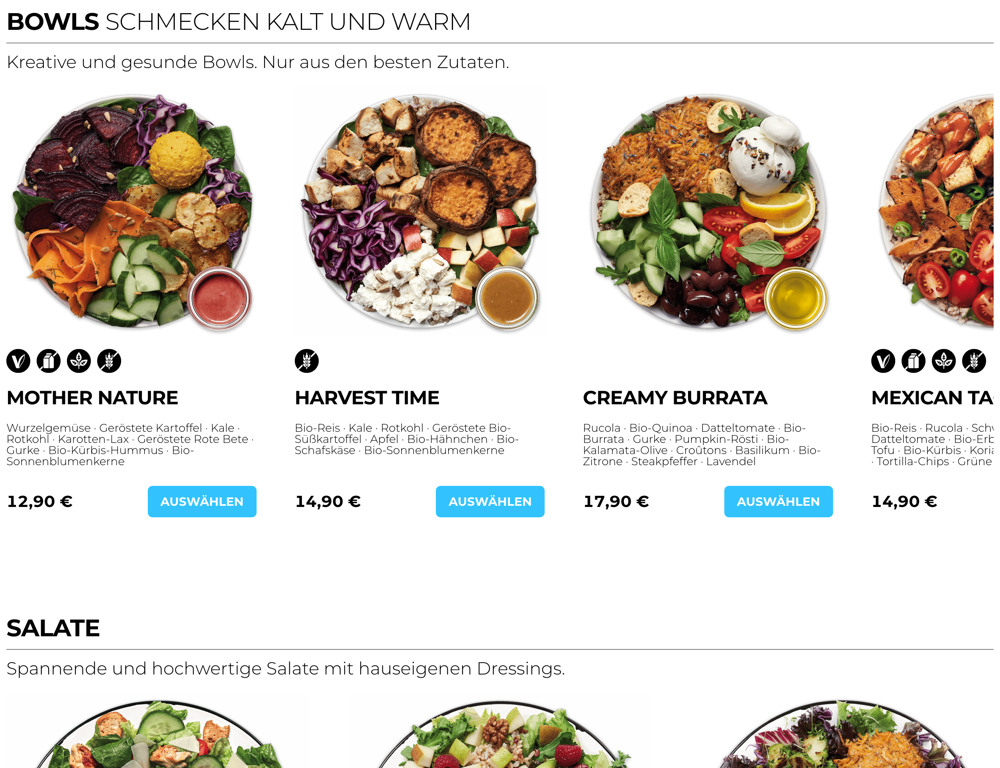

# Stadtsalat code challenge

## Table of contents

- [Overview](#overview)
  - [Screenshot](#screenshot)
  - [Links](#links)
  - [Built with](#built-with)


## Overview

Users should be able to:

- View the meals in a horizontal slider instead of a vertical grid.
- Horizontal layout can be enabled via prop for each Product Grid

```jsx
<ProductsCardGrid list={productsByTags(["product.bowl"])} horizontal />
```

### Screenshot



### Links

- [Code Sandbox](https://codesandbox.io/s/bold-microservice-16o6ww)
- [Live site URL](https://7yi1m0.csb.app/)

### Built with

- React
- TypeScript
- React custom hooks for fetching product data
- [Stitches.dev](https://stitches.dev/) a CSS-in-JS with near-zero runtime, SSR, multi-variant support, and a best-in-class developer experience.
